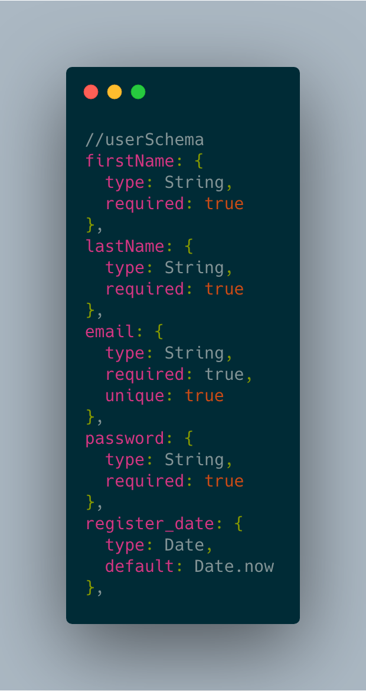
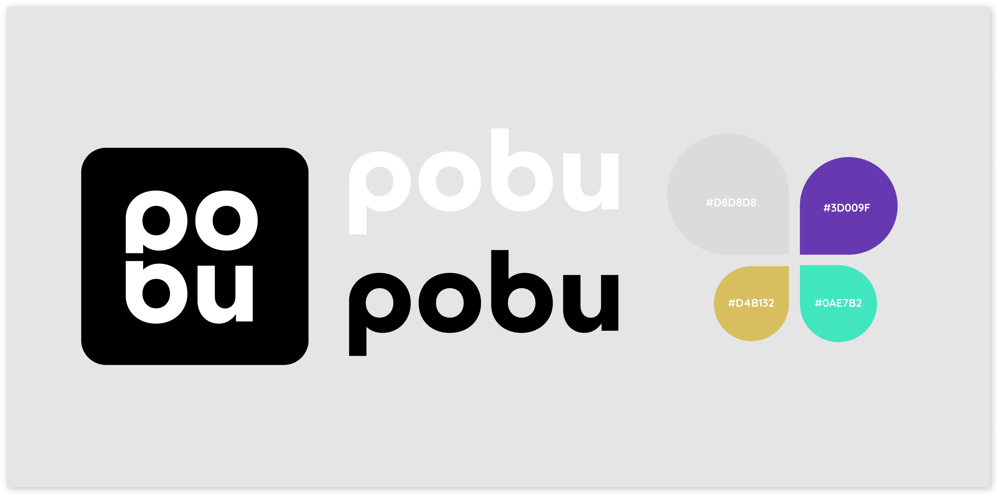

[](https://github.com/ellerbrock/open-source-badges/) 


# pobu.io
*A peer-to-peer booking platform with WebRTC, Socket.IO, React, Express, Node.js and MongoDB.*


 

[Twitter](https://twitter.com/pobu_io)

[Instagram](https://instagram.com/pobu.io)

<br />

## Table of Contents

* [Getting started](#getting-started)
  * [Prerequisites](#prerequisites)
  * [Installation](#installation) 
* [About project](#about-project)
  * [Problem](#problem)
  * [Solution](#solution)
* [Planning](#planning)
  * [Personas](#personas)
  * [User stories](#user-stories)
  * [Business model](#business-model)
  * [Mongoose schemas](#mongoose-schemas)
  * [Kanban](#kanban)
  * [Future plans](#future-plans)
* [Visual design](#visual-design)
  * [Wireframes](#wireframes)
  * [Graphic profile](#graphic-profile)
* [Team](#team)

<br />

# Getting started
These instructions will get you a copy of the project up and running on your local machine for development purposes.

### Prerequisites

#### Back-end:
- MongoDB
- Express

```json
  "dependencies": {
    "bcryptjs": "^2.4.3",
    "body-parser": "^1.19.0",
    "cors": "^2.8.5",
    "debug": "~4.1.1",
    "dotenv": "^8.0.0",
    "express": "^4.17.1",
    "jsonwebtoken": "^8.5.1",
    "moment": "^2.24.0",
    "mongoose": "^5.5.12",
    "morgan": "~1.9.1",
    "passport": "^0.4.0",
    "passport-jwt": "^4.0.0",
    "socket.io": "^2.2.0",
    "validator": "^11.0.0"
  },
```

#### Front-end:
- React

```json
  "dependencies": {
    "axios": "^0.19.0",
    "cypress": "^3.3.1",
    "history": "^4.9.0",
    "jwt-decode": "^2.2.0",
    "moment": "^2.24.0",
    "normalize.css": "^8.0.1",
    "react": "^16.8.6",
    "react-datepicker": "^2.6.0",
    "react-device-detect": "^1.6.2",
    "react-dom": "^16.8.6",
    "react-icons": "^3.7.0",
    "react-router": "^5.0.0",
    "react-router-dom": "^5.0.0",
    "react-scripts": "3.0.1",
    "react-swipeable-routes": "^0.6.0",
    "reblocks": "^0.7.0",
    "simple-peer": "^9.3.0",
    "socket.io-client": "^2.2.0"
  },
```
<br />

### Installation
Clone the repo
```
git clone https://github.com/okasi/pobu.git
```

Change to the `api` folder and install development and production dependencies.

```
cd api
npm install
```

You will need to set up MongoDB.<br /> 
Probably would be easiest to use MongoDB Atlas.<br /> 
Enter the url in .env file located inside api folder.<br /> 

<br /> 

Change to the `view` folder and install development and production dependencies.
```
cd view
npm install
```
In order to make WebRTC signaling work with STUN and TURN servers you need to create a account at:<br /> 
http://numb.viagenie.ca/cgi-bin/numbacct<br /> 
Then you need to fill in your credentials in the .env file located inside the view folder.

<br /> 

Go to the `api` folder and start the server.
```
cd api
npm run server
```

Go to the `view` folder and run the start script.
```
cd view
npm run start
```

<br />

# About project

### Problem
Appointment services such as Calendly, in their current state do not provide direct communication on their platform.<br /> 
Therefore the hosts and clients are dependent on third-party solutions for communication.<br /> 
We feel like that is a area that could be effectivized.<br /> 
It also creates an issue of privacy for the host, because they need to share their "third-party solution" details.

### Solution
A web based application that allows clients to book appointments with hosts on our platform.<br /> 
We provide live communication on the platform so they don't have to be concered about how & where to have the meeting.<br /> 
The privacy of our users is in our best interest. We promise to not sniff our users conversations.<br /> 
This repo will be public so that they can check the source code for themselves.<br /> 
Lastest changes made in the master branch automaticly deploys to our digitalocean droplet via buddy.works.

<br />

# Planning

## Personas
- Hosts
- Clients
- Users (Hosts + Clients)

<br />

## User stories
As a User, I want to be able to register as a user on the platform, <br /> 
so that my bookables and bookings will be connected to me.<br /> 
*Acceptance criteria:*<br /> 
Be able to register as a user with first name, last name, email, password.<br /> 

As a User, I want to be see my profile details.<br /> 
*Acceptance criteria:*<br /> 
Be able to see user first name, last name, email.<br /> 

As a Host, I want to be able to create a bookable.<br /> 
*Acceptance criteria:*<br /> 
Input bookable name, date, time, duration, type of communication.<br /> 

As a User, I want to be able to see my bookables and bookings in a overview page.<br /> 
*Acceptance criteria:*<br /> 
List all bookables and bookings in a overview page.<br /> 

As a Host, I want to be able to share a created bookable to my future Client.<br /> 
*Acceptance criteria:*<br /> 
Unique url to share.<br /> 

As a Client, I want to be able to view the details of a booking and be able to accept it.<br /> 
*Acceptance criteria:*<br /> 
Show bookable details by visiting the unique url, if not already booked be able to accept it.<br /> 

As a User, I want to be able to see changes made to my bookings and bookables in realtime.<br /> 
*Acceptance criteria:*<br /> 
When a booking is accepted, update it live for both host and client without page reload.<br /> 
When a booking is deleted, remove it from overview without page reload.<br /> 
When a booking is unbooked, update it live for both host and client without page reload.<br /> 

As a User, I want to communicate with my peer in realtime when the time is in for my appointment.<br /> 
*Acceptance criteria:*<br /> 
Be able to text chat on booking page.<br /> 
Be able to video & voice chat on booking page.<br /> 

<br /> 

## Business model
Income:
- Commission-based model: Transaction fees (1.25%) {lower than Klarna (1.35%) & PayPal (2.9%)}

Expenses:
- Domain (pobu.io) 350 SEK per year
- Hosting (deploys.io) [8 GB RAM] 200 SEK per month
- Office space (workaround.io) 2000 SEK per person per month

<br /> 

## Mongoose schemas
 

<br />

## Kanban
- [Link to Github Projects](https://github.com/okasi/pobu/projects/1)

<br />

## Future plans
* When Expo SDK v33 is released, rewrite the view with Expo for Web.

* Time zone intelligence.

* Reusable bookables with multiple/range of avaliable dates & times.

<br />

# Visual design 

<br />

## Wireframes
 
[Link to Figma file](https://www.figma.com/file/5rzpAg2jOawC0mHHJrVnms/Wireframes-Copy?node-id=9%3A2
)

<br />

## Graphic profile
 
[Link to Figma file](https://www.figma.com/file/5rzpAg2jOawC0mHHJrVnms/Wireframes-Copy?node-id=9%3A2
)

<br />

# Team
- [Okan](https://github.com/okasi)
- [Esra](https://github.com/esraod)

<br />
<br />

[](https://forthebadge.com)
