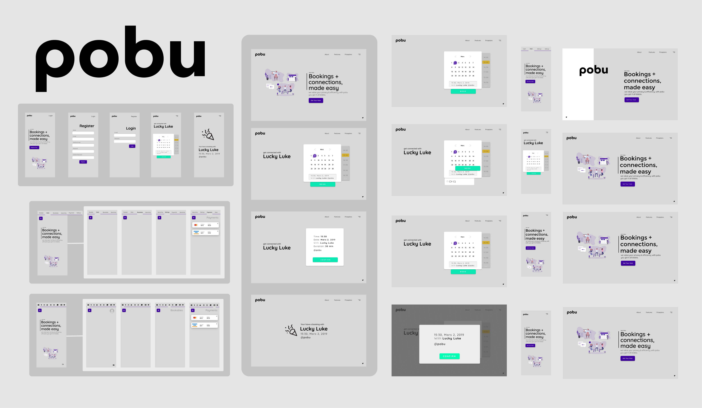

# pobu.io
*A peer-to-peer booking platform with WebRTC, React, Express, Node.js and MongoDB.*


 


[Twitter](https://twitter.com/pobu_io)

[Instagram](https://instagram.com/pobu.io)

<br />

## Table of Contents

* [Getting started](#getting-started)
  * [Prerequisites](#prerequisites)
  * [Installation](#installation)
* [About project](#about-project)
  * [Problem](#problem)
  * [Solution](#solution)
* [Planning](#planning)
  * [Personas](#personas)
  * [User stories](#user-stories)
  * [Entity Relationship Diagram](#entity-relationship-diagram)
  * [Kanban](#kanban)
  * [Future](#future)
* [Visual design](#visual-design)
  * [Wireframes](#wireframes)
  * [Graphic](#graphic)
* [Team](#team)

<br />

# Getting started
These instructions will get you a copy of the project up and running on your local machine for development purposes.
### Prerequisites
#### Back-end:
- MongoDB
- Express
- Node.js
- WebRTC

```json
  "dependencies": {
    "bcryptjs": "^2.4.3",
    "body-parser": "^1.19.0",
    "cors": "^2.8.5",
    "debug": "~4.1.1",
    "dotenv": "^8.0.0",
    "express": "^4.17.1",
    "jsonwebtoken": "^8.5.1",
    "moment": "^2.24.0",
    "mongoose": "^5.5.12",
    "morgan": "~1.9.1",
    "passport": "^0.4.0",
    "passport-jwt": "^4.0.0",
    "socket.io": "^2.2.0",
    "validator": "^11.0.0"
  },
```

#### Front-end:
- React 16.8

```json
  "dependencies": {
    "axios": "^0.19.0",
    "cypress": "^3.3.1",
    "history": "^4.9.0",
    "jwt-decode": "^2.2.0",
    "moment": "^2.24.0",
    "normalize.css": "^8.0.1",
    "react": "^16.8.6",
    "react-datepicker": "^2.6.0",
    "react-device-detect": "^1.6.2",
    "react-dom": "^16.8.6",
    "react-icons": "^3.7.0",
    "react-router": "^5.0.0",
    "react-router-dom": "^5.0.0",
    "react-scripts": "3.0.1",
    "react-swipeable-routes": "^0.6.0",
    "simple-peer": "^9.3.0",
    "socket.io-client": "^2.2.0"
  },
```
<br />

### Installation
Clone the repo
```
git clone https://github.com/okan-s/pobu.git
```

Change to the `api` folder and install development and production dependencies.

```
cd api
npm install
```

You will need to set up MongoDB. 
Probably easiest to use is MongoDB atlas. 
Enter the url in .env file located inside api folder.


Change to the `view` folder and install development and production dependencies.
```
cd view
npm install
```
In order to make WebRTC signaling work with STUN and TURN servers you need to create a account at:
http://numb.viagenie.ca/cgi-bin/numbacct
Then you need to fill in your credentials in the .env file located inside the view folder.


Go to the `api` folder and start the server.
```
cd api
npm run server
```

Go to the `view` folder and run the script start script.
```
cd view
npm run start

```

<br />

# About project

### Problem
Services such as Calendly, in their current state doesn't provide direct communication on their platform. 
Therefore the hosts and clients are dependent on third-party solutions for communication, that creates an issue of privacy.

### Solution
A web based application that allows clients to book appointments with hosts on our platform. We provide live communication without any middle interferance which in term increases the privacy of our users.


<br />

# Planning
Inte tänka bara göra, maskin.
<br />


## Personas
- Clients
- Hosts

<br />

## User Stories

<br /> 

## Entity Relationship Diagram
- 

<br />

## Kanban
- [Github Projects](https://github.com/okan-s/pobu/projects/1)

<br />

## Future
*Future plans/ideas*

When Expo SDK v33 is released, rewrite the view w/ Expo for Web.

<br />

# Visual design 

<br />

## Wireframes
 
[Link to Figma file](https://www.figma.com/file/5rzpAg2jOawC0mHHJrVnms/Wireframes-Copy?node-id=9%3A2
)

<br />

## Graphic
 
[Link to Figma file](https://www.figma.com/file/5rzpAg2jOawC0mHHJrVnms/Wireframes-Copy?node-id=9%3A2
)

<br />
<br />


# Team
- [Okan](https://github.com/okan-s)
- [Esra](https://github.com/esraod)
